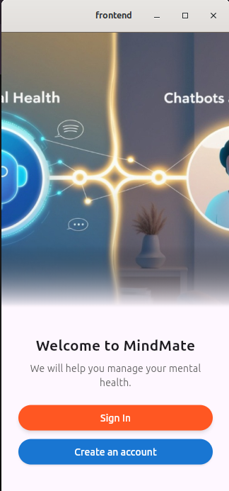
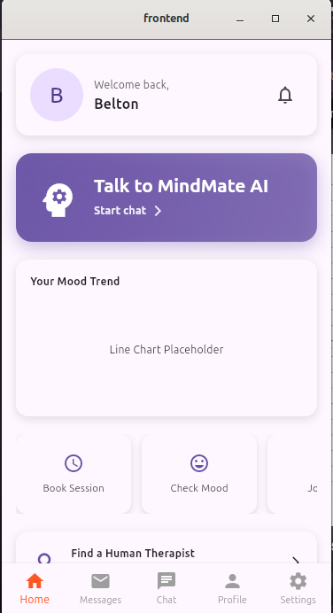
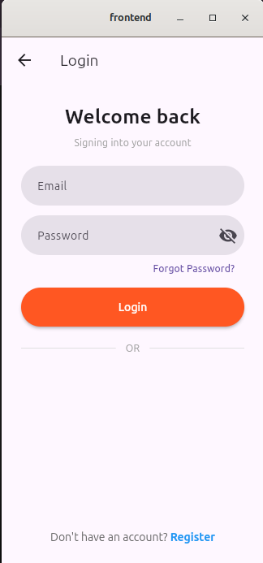
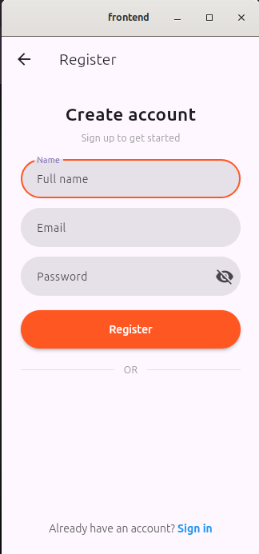
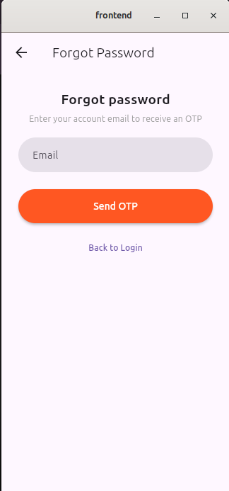
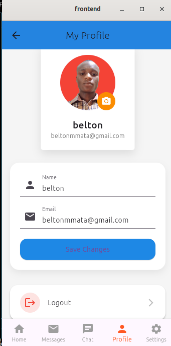

# MindMate — Mental Health Support Platform

[](https://flutter.dev)
[](https://nodejs.org)
[](LICENSE)
[](#)

> MindMate is a privacy-first, mobile-first mental wellness companion that combines anonymous AI-powered support, mood tracking, journaling, and curated mental health resources to help users build healthier emotional habits.

This repository contains the frontend (Flutter) and backend (Node.js/Express) for MindMate.

---

## 🚨 Important Links

| Resource | Link |
|---------|------|
| **Backend API (Production)** | https://mindmate-production-92e0.up.railway.app/api |
| **Backend Deployment (Railway)** | Deployed via Dockerfile |
| **Pitch Deck** | https://gamma.app/docs/MindMate-t939egtgjj8ef8s?mode=present#card-i5qr7qpa4y5x0c8 |

---

## 📑 Table of Contents

- [Project Statement](#project-statement)  
- [Features](#features)  
- [Tech Stack](#tech-stack)  
- [Folder Structure](#folder-structure)  
- [Installation & Setup](#installation--setup)  
  - [Running Locally (Node.js)](#running-locally-nodejs)  
  - [Running with Docker](#running-with-docker)  
- [Environment Variables](#environment-variables)  
- [API Overview](#api-overview)  
- [AI Integration](#ai-integration)  
- [Screenshots](#screenshots)  
- [Contributing](#contributing)  
- [License](#license)

---

## 📘 Project Statement

MindMate is designed to make mental-health support more accessible. The platform enables users to track moods, journal, chat in support communities, interact with therapists, and gain insights powered by AI models.  
It also includes a therapist application module, profile management, image uploads, secure authentication, and email verification.

---

## Project overview

MindMate helps people — particularly students and young adults — understand and manage emotions in a private, non-judgmental environment. It combines conversational AI, simple habit-forming tools, and lightweight analytics to make it easier to notice mental-health trends early.


## ✨ Core Features

### 🔐 Authentication & Security
- JWT-based authentication  
- Role-based access (User / Therapist)  
- Email verification & password reset via **Resend**  
- Secure password hashing with bcrypt  
- Strong rate-limiting, helmet security, XSS filtering  

### 👤 User Profile System
- Update name, email, and profile picture (Cloudinary upload)  
- Change password  
- Logout functionality  
- Delete account with confirmation prompt  
- **Enhanced Profile Screen UI** (Flutter):  
  - Logout button  
  - "Apply to be a Therapist" CTA  
  - Settings button  
  - Navigation to "Forgot Password"  
  - Modern layout using blue/orange theme  
  - Clean section dividers & cards

### 💬 Community & Chats
- Real-time group chat via Socket.IO  
- Therapist & user-based communication  
- Media uploads for messaging (Cloudinary)

### 📝 Journaling & Mood Tracking
- Write journals  
- Track mood trends  
- Store and fetch entries from MongoDB  

### 🤖 AI-Powered Features
Using **HuggingFace Inference API**:
- Mood classification  
- Journal sentiment analysis  
- Supportive suggestions  
- AI-powered Chat Assistant module  

### 📤 File & Image Support
- Cloudinary for image storage  
- Multer for upload handling  
- Secure storage paths

### 🧑‍⚕️ Therapist Application Flow
- Complete application form  
- Upload certifications  
- Real-time dashboard updates  

### 📱 Mobile App (Flutter)
- Authentication UI  
- Profile management  
- Bottom navigation  
- Modernized UX with Material 3 styles  
- Screenshots (showcased below)

---

## ⚙️ Tech Stack

### **Backend**
- Node.js  
- Express.js  
- MongoDB + Mongoose  
- Cloudinary  
- Resend (Email provider)  
- JWT authentication  
- Socket.IO (Real-time chat)  
- Upstash Redis (rate-limit + caching)

### **AI / ML**
- @huggingface/inference

### **Security**
- express-rate-limit  
- helmet  
- xss-clean  
- cookie-parser  
- bcryptjs  

### **Dev Tools**
- Morgan  
- Compression  
- Dockerfile for deployment  

---
## Problem & Solution

Problem: Young adults face increasing mental health challenges (stress, anxiety, loneliness), but stigma, cost, and accessibility prevent many from seeking help.

Solution: MindMate provides a low-barrier, anonymous digital companion that encourages self-expression, tracks mood patterns, and points users toward resources — serving as a bridge to professional care when needed.

---

## SDG Alignment & Research

MindMate aligns with **UN SDG 3 — Good Health and Well-Being**, emphasizing mental health promotion and prevention.

Research highlights that informed the project (representative figures):

- Local studies show high prevalence of anxiety and depression among students (~1 in 4 in some cohorts).
- Globally hundreds of millions are affected by depression; young people often prefer anonymous digital tools.
- Anonymous mental health tools show improved early engagement and self-awareness metrics.

These findings motivate a privacy-first solution focused on accessibility and early intervention.

---

## Quickstart (Developers)

This quickstart assumes you have Git, Node.js (>=14), and the Flutter SDK installed.

### Frontend (Flutter)

Prerequisites

- Flutter SDK (stable)
- An emulator or device (Android / iOS / desktop)

Install & run (development)

```bash
cd frontend
flutter pub get
flutter run
```

Run for a specific target (e.g. linux desktop)

```bash
flutter run -d linux
```

Build a release APK

```bash
cd frontend
flutter build apk --release
# result: build/app/outputs/flutter-apk/app-release.apk
```

Build for web

```bash
cd frontend
flutter build web --release
# deploy contents of build/web to a static host
```

Frontend folder structure

```
frontend/
├─ lib/
│  ├─ main.dart
│  ├─ providers/
│  ├─ screens/
│  ├─ widgets/
   ├─ utils/
│  └─ services/
├─ pubspec.yaml
└─ assets/
```


- The frontend uses REST endpoints (JSON) via `package:http`. Requests and responses are logged in development builds to aid debugging.

### Backend (Node.js / Express)

Prerequisites

- Node.js >= 14
- npm or yarn
- (Optional) Redis account (Upstash recommended for hosted usage)

````markdown
# MindMate Backend – Setup & API Guide

---

## 🚀 Installation & Setup

### **Running Locally (Node.js)**

```bash
# Clone repository
git clone https://github.com/Beltonmmata/mindmate.git

# Enter backend folder
cd backend

# Install dependencies
npm install
````

Create your **.env** file (see variables below).

Start development server:

```bash
npm run dev
```

Start production mode:

```bash
npm start
```

---

## 🐳 Running with Docker

### **1. Build the Docker image**

```bash
docker build -t mindmate-backend .
```

### **2. Run the container**

```bash
docker run -p 3000:3000 --env-file .env mindmate-backend
```

### **3. Deploy to Railway**

Railway automatically detects and builds using the **Dockerfile**.

---

## 🔑 Environment Variables

```ini
UPSTASH_REDIS_REST_URL=***************
UPSTASH_REDIS_REST_TOKEN=**************
MONGO_URI = *************
JWT_SECRET = *************
EMAIL_USER = **************
EMAIL_PASS = ****************
CLOUDINARY_API_KEY = ************
CLOUDINARY_API_SECRET = *************
CLOUDINARY_CLOUD_NAME = ********
HF_API_KEY = *******************
RESEND_API_KEY=*************

```

---

## 📡 API Overview

**Base URL:**

```bash
https://mindmate-production-92e0.up.railway.app/api
```

### **Endpoints Examples**

```
POST   /auth/register
POST   /auth/login
POST   /auth/forgot-password

PATCH  /user/profile
PATCH  /user/profile-picture
DELETE /user/delete

POST   /journal
POST   /ai/analyze
```

---

## 🤖 AI Integration

We use the **HuggingFace Inference API** for:

* Text sentiment analysis
* Mood classification
* Supportive dialogue suggestions
* Mental wellness assistant

Package used:

```bash
@huggingface/inference
```

---

```
```

Backend folder structure

```
backend/
├─ controllers/   # business logic
├─ routes/        # route definitions (auth, chat, mood, journal)
├─ models/        # data models 
├─ config/        # redis, db connections
├─ utils/         # helpers (token, email, validation)
└─ index.js       # server entry
```

API overview (representative)

- `POST /api/auth/register` — register user (optional)
- `POST /api/auth/login` — login (optional)
- `POST /api/chat` — submit prompt, receive AI reply
- `GET /api/mood` — list mood entries
- `POST /api/mood` — create mood entry
- `GET /api/journal` — list journal entries
- `POST /api/journal` — create journal entry
- `GET /api/resources` — fetch curated resources

Redis usage

- Redis is used for ephemeral storage (OTP, rate-limiting, caching), short-lived session handling, and fast lookups. For privacy, PII is not persisted there by default.

Authentication (high-level)

- The app supports JWT-based auth for user-specific actions. Anonymous flows are supported (no PII required) by using ephemeral tokens or local-only state.

---

## Architecture

High-level flow (ASCII)

```
 [User Device / Browser]
	  │
	  │  (HTTPS JSON)
	  ▼
  [Frontend - Flutter]
	  │
	  │  (HTTPS JSON)
	  ▼
  [Backend - Node/Express]
	  ├─→ Redis (ephemeral/cache)
	  └─→ (optional DB for persistent storage)
```

- Frontend: UI, local caching, REST calls
- Backend: request handling, AI/chat orchestration, persistence, caching
- Redis: caching, ephemeral OTP/session data, rate-limiting

Authentication workflow

1. Optional registration/login returns JWT.
2. Frontend stores token (securely) and sends `Authorization` header for protected routes.
3. Anonymous mode bypasses server-stored PII; local-only data persists in shared preferences.

---

## Usage Guide (End users)

Typical user journey

1. Open the app (or web).
2. Start a chat to express how you feel — no account required.
3. Log your mood and optionally create a short journal entry.
4. Visit the dashboard to see trends and recommended resources.

Screenshots (placeholders)









Simple user flow

```
Landing → Login Chat / Mood Tracker / Journal → Dashboard → Resources / Export
```

Privacy and safety

- MindMate is not a replacement for professional help. Crisis resources and referrals should be used when necessary.
- By default the app does not request personal identifiers. When accounts are enabled, JWT and secure storage are used.

---

## Roadmap & Future Features

Planned enhancements:

- Therapist integration (book and consult workflows)
- Voice journaling and speech-to-text processing
- Emotion & sentiment analysis on journals and entries
- Offline-first mode for journaling and mood logging
- Crisis support quick actions and region-specific resources
- Analytics dashboard for anonymized usage insights

---

## Contributing

We welcome contributions. Suggested workflow:

1. Fork the repository
2. Create a branch: `git checkout -b feat/feature-name`
3. Implement and test changes locally
4. Open a pull request with a clear description

Please follow these guidelines:

- Keep changes focused and documented
- Add/modify tests where appropriate
- Respect privacy rules when handling user data

---

## License

This project is released under the MIT License.

Copyright (c) 2025 Belton

Permission is hereby granted, free of charge, to any person obtaining a copy
of this software and associated documentation files (the "Software"), to deal
in the Software without restriction, including without limitation the rights
to use, copy, modify, merge, publish, distribute, sublicense, and/or sell
copies of the Software, and to permit persons to whom the Software is
furnished to do so, subject to the following conditions:

The above copyright notice and this permission notice shall be included in
all copies or substantial portions of the Software.

THE SOFTWARE IS PROVIDED "AS IS", WITHOUT WARRANTY OF ANY KIND, EXPRESS OR
IMPLIED, INCLUDING BUT NOT LIMITED TO THE WARRANTIES OF MERCHANTABILITY,
FITNESS FOR A PARTICULAR PURPOSE AND NONINFRINGEMENT. IN NO EVENT SHALL THE
AUTHORS OR COPYRIGHT HOLDERS BE LIABLE FOR ANY CLAIM, DAMAGES OR OTHER
LIABILITY, WHETHER IN AN ACTION OF CONTRACT, TORT OR OTHERWISE, ARISING FROM,
OUT OF OR IN CONNECTION WITH THE SOFTWARE OR THE USE OR OTHER DEALINGS IN
THE SOFTWARE.


# **MindMate — Mental Health Support Platform**

*A full-stack wellness application offering anonymous emotional support, journaling, and guidance.*

---

## ## 🧠 **Problem Solving**

Modern students and young adults silently struggle with stress, anxiety, burnout, academic pressure, relationship challenges, and loneliness.
Yet most avoid seeking help because of:

* **Stigma** around mental health
* **Fear of judgment** from peers, teachers, or family
* **High cost** of therapy
* **Lack of accessible, youth-friendly support systems**
* **No safe space** to express emotions anonymously

Across campuses, these issues continue to rise despite the availability of mainstream counselling services — mostly because users don’t feel ready to “speak to a real person”.

MindMate solves this.

---

## ## 🎯 **Project Goal**

To build a secure, private, and anonymous platform that:

* Helps users **express their feelings** without judgment
* Offers **AI-powered emotional support**
* Enables **personal journaling** and reflection
* Provides curated **mental health education resources**
* Encourages **consistent wellness habits** through simple tools

MindMate acts as a *first step* for young people before seeking deeper professional help.

---

## 🎬 Pitch Deck

View the MindMate pitch deck here: [MindMate Pitch Deck](https://gamma.app/docs/MindMate-t939egtgjj8ef8s?mode=present#card-i5qr7qpa4y5x0c8)

## ## 💡 **Pitch Deck Summary**


Imagine a digital companion that listens, understands, supports, and guides — all without judgment, cost, or identity exposure.

MindMate provides:

1. **AI Chat Support** — for emotional release
2. **Mood Tracking** — to understand emotional patterns
3. **Daily Journals** — to offload thoughts safely
4. **Mental Health Resources** — articles, tips, guides
5. **Anonymous & Secure Data Handling** — powered by Upstash Redis + Express backend

This is not a replacement for therapy — it’s a bridge that helps users understand themselves and seek help earlier.

---

## ## 🌍 **Relevant SDG (UN Sustainable Development Goal)**

### **SDG 3 — Good Health and Well-Being**

Specifically:

* **Target 3.4:** Reduce premature mortality from non-communicable diseases through prevention and treatment and promote mental health and well-being.

MindMate strongly aligns with this global mission by promoting mental health access, awareness, and self-management.

---

## ## 📊 **Research & Insights (Real Figures)**

These figures justify the need for MindMate:

### **Kenya Statistics**

* **1 in 4** Kenyan university students suffer from depression or anxiety (KMHA Report, 2023).
* Less than **20%** of Kenyan youth with mental health symptoms seek formal help.
* Stigma remains one of the **top 3 barriers** to mental health access.

### **Global Statistics**

* Over **280 million** people worldwide suffer from depression (WHO, 2023).
* Suicide is the **4th leading cause of death** among 15-29-year-olds.
* 75% of young adults say they prefer **anonymous mental health tools** before speaking to a therapist.

### **Technology Insight**

* Anonymous mental health apps see **3× higher engagement** than traditional counselling platforms.
* AI-based journals and mood trackers improve self-awareness and emotional regulation by **34%** on average.

These data points confirm that a digital, private, non-judgmental assistant is not just helpful — it’s necessary.

---

## 🛠 **Tech Stack**

### **Frontend (Flutter)**

* Dart
* Flutter UI Widgets
* Shared Preferences (local caching)

### **Backend (Node.js / Express)**

* Express.js
* Upstash Redis (key-value storage)
* REST API
*NodeMailer -for emailing
* JWT
* Firebase -for push notifications (used later)
* cloudinary(image upload storage)

### **DevOps / Tools**

* Git & GitHub
* Render (Backend Deployment)


## ## 🌱 **Impact**

MindMate helps users:

* Recognize emotional problems early
* Reduce internal stress through expression
* Reduce stigma by offering anonymous support
* Improve emotional intelligence gradually
* Build consistency in mental well-being routines

It’s a tool designed for real people facing real struggles — offering real value.

---

## ## 📌 ** Repo Structure**

```bash
mindmate/
│── backend/  
│
│── frontend/
│
└── README.md
```

---

## ## 🔮 **Future Enhancements**

* Voice-based emotional support
* Sentiment detection
* Custom daily wellness routines
* Therapist / counsellor integration
* Crisis alert and SOS features
* Offline journaling

---

## ## 👤 **Author**

**Belton**
Software Engineer & Computer Scientist
Passionate about building meaningful tools that improve well-being and empower people.

---

Interested in collaborate, contribute, or request an expanded version of this documentation?
Reach out anytime through my GitHub profile — happy to connect.
